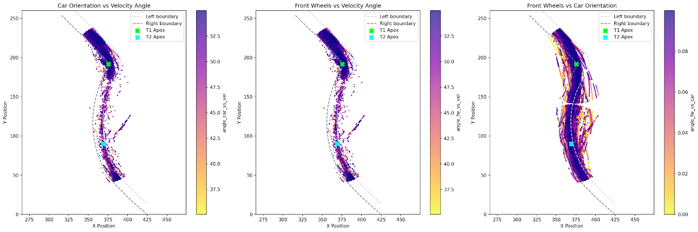
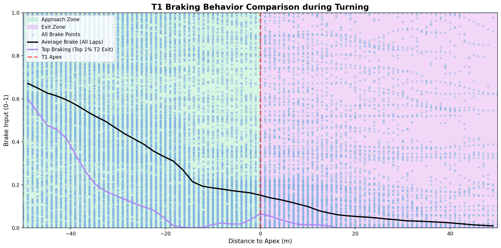
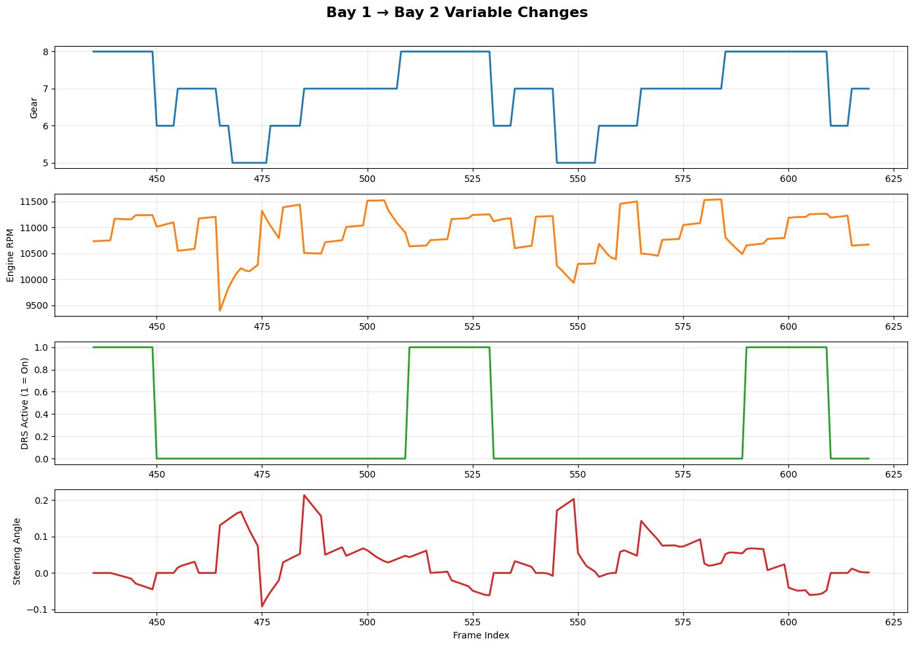

# data3001-data-f1-7

## 1. Project Description

This project transforms raw Formula 1 telemetry data into a refined dataset aimed at understanding and improving cornering performance at Melbourne’s Albert Park circuit. Our goal is to uncover how environmental, mechanical, positional, and control variables influence cornering speed and ultimately lap times.

In F1 racing, cornering is a critical performance lever: How fast a car carries speed through turns influences its exit velocity onto the straights, which in turn affects overtaking potential and total lap time. Small gains in cornering stability or speed can cascade into large gains over a race. By identifying the data-driven relationships between inputs (throttle, brake, steering) and outputs (speed, lap time), this work could help refine setups or driver decisions under varying conditions. Moreover, doing this analysis specifically for Albert Park adds contextual relevance, as track geometry and elevation changes all factor in uniquely.

Prior studies in motorsports analytics often lean on simplified simulations, idealized models, or coarse-grained datasets. Some works examine driver behavior broadly or compare whole-lap times, but few dissect corner-level dynamics in detail, especially combining raw telemetry and environmental data. Our approach builds on that literature by working with high-resolution frame-level telemetry and focusing on a specific circuit to localize the insights.

We will ingest telemetry streams that include vehicle position, velocity, orientation, rotational data, and driver control signals (throttle, brake). These will be merged with session metadata (e.g. timestamping) and environmental readings (track temperature, ambient pressure). We’ll preprocess the data to clean, sync, and align frames, filter for the relevant track sections (corners), and engineer derived features (e.g. angular acceleration, lateral G forces, steering input gradients). From there, modeling (e.g. regression, decision trees) will seek to quantify and predict performance under varying scenarios.

## 2. Sources
2024 F1 Australian Grand Prix Telemetry in Melbourne Albert Park：
The primary data source for this project is the 2024 Formula 1 Australian Grand Prix telemetry dataset, recorded at the Melbourne Albert Park Circuit. This telemetry data provides high-frequency measurements capturing the behavior of F1 cars as they navigate the circuit. The dataset includes several categories of information that together create a comprehensive picture of vehicle performance and driver interaction.

### 2.1 Vehicle positioning and motion data:
The first key source component is vehicle positioning and motion data, which records the car’s 3D spatial coordinates (`M_WORLDPOSITIONX_1`, `M_WORLDPOSITIONY_1`, `M_WORLDPOSITIONZ_1`), velocity components (`M_WORLDVELOCITYX_1`, `M_WORLDVELOCITYY_1`, `M_WORLDVELOCITYZ_1`), and orientation vectors `M_WORLDFORWARDDIRX_1`, `M_WORLDRIGHTDIRY_1`. These readings describe how the car moves and rotates along the circuit, allowing for reconstruction of trajectories and calculation of cornering forces.

### 2.2 Driver control inputs:
The second key source is driver control input data, which captures real-time human actions such as throttle percentage `M_THROTTLE_1`, braking intensity `M_BRAKE_1`, steering angle `M_STEER_1`, and gear selection `M_GEAR_1`. These variables are crucial for understanding how driver decisions influence the car’s dynamic response and how control inputs correlate with speed, stability, and efficiency through corners

### 2.3 Session metadata and timing information:
Finally, session metadata and timing information—including variables like `M_TIMESTAMP`, `M_CURRENTLAPTIMEINMS_1`, `M_SECTOR1TIMEINMS`, and `RACETIME` provide temporal and contextual structure to the telemetry. This ensures accurate alignment across laps, sectors, and sessions, while enabling detailed performance comparisons.

Together, these three components create a comprehensive, multi-dimensional dataset of approximately 774,000 telemetry samples and 59 variables, validated through geometric alignment and filtering to retain only realistic, on-track racing data. This dataset serves as a robust foundation for modeling vehicle dynamics, evaluating driver behavior, and optimizing cornering performance at Albert Park.

## 3. Workflow
### 3.1 Loading data
First, we loaded the raw UNSW F1 2024 telemetry dataset using the read_data() function, then the related reference files, `f1sim-ref-left.csv`,`f1sim-ref-right.csv`, and `f1sim-ref-line.csv`, using the `read_process_left()`, `read_process_right()`, and `read_process_line()` functions. The Albert Park circuit's official track limits are represented by the left and right boundary files, which we used to confirm the accuracy of on-track data. These datasets were limited to the same coordinate range as the primary telemetry data to maintain spatial consistency. This alignment offers a solid geometric basis for the validation, racing-line analysis, and spatial filtering processes that follow.

### 3.2 Data cleaning
Upon initial exploration and plotting, we observed that the dataset contained laps from multiple circuits, not just the one of interest. To focus exclusively on the Albert Park track in Melbourne, we used the `filter_melbourne()` function to retain only laps recorded on that circuit. Further inspection revealed missing values in the world position coordinates and some duplicated rows, likely due to inconsistencies in the data collection process. Since the world X and Y coordinates `M_WORLDPOSITIONX_1` and `M_WORLDPOSITIONY_1` form the foundation for all spatial analysis and visualisation, we removed any rows with missing values using the `remove_na()` function. This ensured that every telemetry point could be accurately positioned on the track, preventing issues with incomplete laps or plotting errors in later analysis. Additionally, several columns contained missing or duplicated information that did not contribute to modelling or analysis. These were removed using the `remove_redundant_cols()` function, leaving a clean and concise dataset suitable for further processing.

### 3.3 Lap Structuring
After cleaning the positional data, we structured the dataset to make it easier to analyse the laps. Using the `re_index()` function, we created a unique lap identifier, lap_index for each session–lap pair. This was done by grouping the data by session ID and current lap number, separating the dataset into distinct laps. This structure made it easier to visualise, compare, and summarise telemetry data on a per-lap basis, which is essential for subsequent analysis and modelling. 
To further ensure data quality and consistency, we applied the `remove_stuttery_laps()` function to eliminate laps with an insufficient number of distinct telemetry rows. This function identifies and removes laps containing fewer than 500 unique xy-coordinate points. Such laps typically result from duplicated or incomplete telemetry recordings, where the car’s position data appears static or discontinuous. By enforcing this threshold, only laps with a sufficiently dense and continuous stream of positional data were retained, ensuring that subsequent spatial analyses and performance modelling were based on complete and reliable lap data.

### 3.4 Track Boundaries
The first step in this process involved using the `define_cut_line()` function, which automatically calculated the start and end coordinates of the sector’s boundary lines. Beginning from a reference point on the right side of the track, `define_cut_line()` determined the local direction of the boundary using neighbouring points and then constructed a perpendicular line extending across to the left boundary. The result was a line segment connecting the corresponding right and left boundary points, effectively defining the geometric “cut” across the circuit that marks the start and end of the selected track sector. By deriving these boundaries programmatically, we ensured consistency and reproducibility across all laps and sessions.

Once the entry and exit lines were defined, the `track_slice()` function was applied to the telemetry dataset. This function spatially restricted the data to the region enclosed between the start and end lines, effectively isolating the section of the track that covers Turns 1 and 2 of the Albert Park circuit. Through this process, we filtered out all other portions of the lap, allowing subsequent analyses and visualisations to focus exclusively on a consistent and well-defined track segment directly aligned with the main objective of our project.

### 3.5 Remove Invalid Tracks
During initial inspection, we noticed that several laps contained telemetry points located well outside the left and right track boundaries. According to racing regulations, a lap is considered valid only if at least one wheel of the car remains within the track limits at all times. Based on this guideline, we estimated the approximate width of a Formula 1 car and used it as a tolerance margin to determine whether a point was still within the legal track area. We then implemented the `enforce_track_limits()` function to validate each telemetry point against the geometric boundaries of the Albert Park circuit. Any laps containing points that exceeded these adjusted limits were removed, ensuring that the final dataset represented only valid, on-track driving behaviour suitable for further analysis and modelling.

### 3.6 Lap Summary and Feature Aggregation
Instead of analysing thousands of individual data points, we decided to condense each lap into a single row containing representative statistics such as average line deviation, braking and throttle behaviour, and proximity to key corners. This approach simplifies performance comparison between laps, drivers, or sessions and provides a modelling-ready dataset for regression or clustering analysis.

The `initialise_lap_summary()` function creates the foundational summary DataFrame, recording each lap’s index and total sector time. This is achieved by calculating the time difference between the first and last recorded timestamps `CURRENTLAPTIME` for each lap. This metric serves as a baseline measure of overall lap duration and enables subsequent analysis of how various features relate to performance time.

The `avg_line_distance()` function adds a measure of spatial consistency by computing the average deviation from the racing line for each lap. It groups all telemetry points by lap_index and averages their perpendicular distances to the reference line, giving an indicator of how closely a driver followed the optimal path through the circuit. Smaller average distances suggest better adherence to the ideal line and, generally, higher performance consistency.

The `min_apex_distance()` function calculates the minimum distance to each apex (Turns 1 and 2) for every lap. By using a KD-Tree nearest-neighbour search, it determines how close a driver’s trajectory came to the ideal apex points. This helps quantify cornering precision — laps that approach the apex more closely are typically associated with smoother and faster cornering performance.

The `add_avg_brake_pressure()` and `add_avg_throttle_pressure()` functions compute the mean brake and throttle pressures across each lap. These values summarize a driver’s overall input style — for example, whether a lap involved aggressive braking or smooth, consistent throttle application. Such aggregates are useful for distinguishing different driving strategies and their influence on lap time.

The `add_peak_brake_pressure()` and `add_peak_throttle_pressure()` functions record the maximum brake and throttle inputs within each lap. These features capture extremes of driver control and can reveal how much braking force or acceleration was applied in key segments. Comparing these peak values across laps helps assess consistency in control inputs and vehicle dynamics under varying cornering conditions.

The `first_braking_point()` function identifies the first instance of braking within each lap where the brake input exceeds a set threshold (default = 0.2). It records the spatial coordinates (brake_x, brake_y) and pressure at that point. This allows analysts to determine how early or late drivers initiate braking before entering Turn 1, which is crucial for studying braking strategy and corner entry efficiency.

Similarly, the `first_turning_point()` function detects the first steering action beyond a set threshold (default = 0.2 in either direction). It logs the corresponding coordinates and steering angle, representing the moment a driver begins turning into the corner. Comparing the timing and position of these first turning points across laps reveals differences in driver anticipation and line approach into the corner sequence.

Finally, the `summary_eng()` function orchestrates all the above computations to produce the completed lap summary dataset. It integrates each lap’s timing, geometric, and control-input features into a single, comprehensive table. This summary provides an interpretable, lap-level view of performance — simplifying analysis, enabling efficient visualisation, and supporting downstream modelling tasks such as predicting lap times or evaluating driver behaviour.

### 3.7 Telemetry Feature Engineering
We decided to engineer some features that will provide point-level telemetry into interpretable, modelling-ready features that describe how the car is driven through Turns 1–2. Instead of only relying on lap aggregates, we compute per-sample signals that capture driver behaviour, vehicle dynamics, and line efficiency. These features power visual analyses and serve as inputs for downstream models that relate control inputs and trajectory to outcomes like corner-exit speed or sector time.

  

1) `angle_car_vs_vel` – Car’s Facing Direction vs. Velocity Vector
This feature quantifies slip angle or the difference between where the car is pointing and where it’s actually moving. It serves as a powerful indicator of yaw control and chassis stability through a corner. Small angles suggest the car is tracking smoothly with high grip, while larger angles reflect sliding or oversteer moments where the rear rotates beyond the intended line. Top drivers tend to allow a brief, controlled increase in this angle just before the apex to help rotate the car, then minimize it on exit to regain traction. angle_car_vs_vel captures how efficiently a driver manages yaw to balance rotation and stability through a turn.

2) `angle_fw_vs_vel` – Front Wheel Direction vs. Velocity Vector
This feature measures how well the car’s actual motion aligns with the direction the front wheels are pointing. It’s a direct reflection of front-end grip and steering efficiency — larger deviations imply understeer or tire slip, where the wheels are turned but the car resists rotation. During turn-in, this angle peaks as the driver loads the front tires, before decreasing once the car rotates and stabilizes mid-corner. Our EDA showed that the best laps often show quick, short-lived peaks followed by smooth convergence, indicating precise and confident steering. angle_fw_vs_vel therefore reveals how effectively the driver’s steering input translates into directional change, making it invaluable for analyzing corner entry technique and tire performance.

3) `angle_fw_vs_car` – Front Wheel Direction vs. Car Facing Direction
This feature isolates the driver’s steering input magnitude, showing how far the front wheels are turned relative to the car’s forward direction. High values indicate aggressive or corrective oversteering, while smaller values reflect smoother, more stable cornering. Around Turn 1, this metric typically rises sharply at turn-in, oscillates slightly through the apex (representing micro-adjustments), and falls back to zero on corner exit as the car straightens. By comparing angle_fw_vs_car to the two previous features, we can distinguish between driver-induced behavior (intent) and vehicle dynamics (response), offering a clear picture of how steering input quality affects rotation, balance and time.

  

1) Early and lower average braking: Top drivers begin braking earlier and with lower peak pressure, allowing smoother deceleration and better front-end grip. In contrast, average drivers maintain higher brake pressure later, taking up to 40m post-apex before reaching zero input, whereas top drivers reach zero brake input around -18 m at the pre-apex.

2) Multi-tap brake modulation: Top drivers display a multi-tap or oscillating brake pattern leading into the apex (see purple Top Braking line where this occurred 3 times from -50m to -20m), reflecting precise modulation to balance weight transfer, maintain optimal tire slip, and prepare the car for rotation into the corner. Average drivers tend to apply a more constant, monotonic brake input.

3) Apex brake adjustment / Yaw control: Top drivers briefly reapply a small amount of brake at the apex itself to control yaw, fine-tuning the car’s rotation at the moment of minimum longitudinal load and maximizing exit potential (see hump at T1 apex). Average drivers’ sustained brake input delays rotation and reduces exit speed.

Together, these behaviors of early, modulated braking, precise timing of zero input, and subtle pre-apex taps demonstrate advanced control of weight transfer, tire friction, and car balance, explaining why top drivers can carry more speed through the corner by utilising pragmatic braking while maintaining stability.

### 3.8 Assisted passing conditions
Gear + RPM trace the power delivery profile.DRS delineates aero state changes that affect top-speed zones.Steering Angle captures driver precision and car balance in direction changes.Together they form the rhythm of braking–turn-in–power-on, the fundamental cycle of lap-time optimization through the two corners.

  

    
1) Gear
High gears (7-8) represent full throttle on a straight; downshifting to 5-6 is braking for cornering; sequential upshifts resume acceleration after exiting a corner. Gear changes correspond to deceleration and acceleration phases: downshifting assists braking, upshifting restores speed.
2) Engine RPM
Speed ​​changes with throttle and gear. Speed ​​decreases in braking zones, reflecting throttle release and braking; peak speed increases when DRS is engaged. This reflects traction and throttle control during cornering.
3) DRS (Drag-Reduction System)
Green line = 1 indicates DRS on (straight); 0 indicates off (cornering). It is off before T1 to ensure stability, briefly engaged on the straight from T1 to T2, and then off again before T2.
4) Steering Angle
Small fluctuations represent fine-tuning in a straight line; larger positive/negative deflections correspond to T1 cornering and countersteering during T2; a return to 0 indicates a positive exit from the corner.

### 3.9 Data Creation
In order to create and access the data product. You must run create_data.py in the root of this repository. This script expects the following file structure. 

    data3001-data-f1-7/
        ├── create_data.py
        └── data/
            ├── f1sim-ref-left.csv
            ├── f1sim-ref-right.csv
            ├── f1sim-ref-line.csv
            └── UNSW F12024.csv

The script will produce telemetry.csv, summary.csv, left.csv, right.csv, line.csv. the most important products are telemetry.csv, which is the point-by-point lap data, and summary.csv, which is the high-level overview of each lap. 

## 4. Data Description
After the complete cleaning and spatial filtering process, the final dataset consists of approximately 774,772 rows and 59 columns, representing valid telemetry data points recorded during the first two turns (Turns 1–2) of the Albert Park Circuit. Each row corresponds to a single telemetry sample captured within these turns, while each column represents a signal, sensor reading, or engineered feature. The dataset has been geometrically validated using track boundaries, start and end cut lines, and strict on-track constraints to ensure that only realistic racing behaviour is retained.
The final data product is designed for high-quality, reproducible modelling and visualisation. All laps were spatially aligned using the define_cut_line() and track_slice() functions to ensure a consistent reference frame across sessions. Following filtering, additional feature engineering was performed in a layered, progressive approach divided into Basic Features and Advanced Features, each building on the previous layer to quantify driver performance, vehicle behaviour, and cornering efficiency.

### 4.1 Engineered and Derived Features 
| **Group**                                            | **Column(s)**                                            | **Description**                                                                       |
| ---------------------------------------------------- | -------------------------------------------------------- | ------------------------------------------------------------------------------------- |
| **Lap Counter**                                      | `lap_index`                                              | Derived from ordered laps; used for grouping and plotting.                            |
| **Distance to Corner Apex (m)**                      | `dist_to_t1_apex`, `dist_to_t2_apex`                     | Calculated from car position and track geometry.                                      |
| **Boolean Indicators**                               | `is_t1_window`, `is_t2_window`                           | True if the sample lies within each corner’s analysis window.                         |
| **Along-Path Distance (m)**                          | `line_distance`                                          | Computed after geometric alignment with `track_slice()`.                              |
| **Combined Control Metric**                          | `M_BRAKE_THROTTLE_1`                                     | Derived to measure brake–throttle overlap and control transitions.                    |
| **Velocity Components (m/s)**                        | `VEL_X`, `VEL_Y`, `VEL_Z`                                | Decomposed from world velocity vectors to quantify movement direction.                |
| **Lateral, Longitudinal, and Vertical G-Forces (g)** | `GFORCE_X`, `GFORCE_Y`, `GFORCE_Z`                       | Calculated from motion and orientation vectors to measure dynamic load.               |
| **Angular Differences (°)**                          | `angle_fw_vs_vel`, `angle_car_vs_vel`, `angle_fw_vs_car` | Quantify slip, drift, and directional misalignment between car, wheels, and velocity. |
| **Temperature Differentials (°C)**                   | `brake_front_rear_diff`, `brake_left_right_diff`         | Derived from brake temperatures to indicate mechanical or load imbalance.             |

### 4.2 Original Telemetry Variables
| **Group**                        | **Column(s)**                                                                                                                                                                                                                                                                                                                            | **Description**                                                                                                                                                                                             |
| -------------------------------- | ---------------------------------------------------------------------------------------------------------------------------------------------------------------------------------------------------------------------------------------------------------------------------------------------------------------------------------------- | ----------------------------------------------------------------------------------------------------------------------------------------------------------------------------------------------------------- |
| **Identifiers & Metadata**       | `M_SESSIONUID`, `lap_index`, `M_CURRENTLAPNUM`                                                                                                                                                                                                                                                                                           | Unique session and lap identifiers used to distinguish individual laps and group telemetry data.                                                                                                            |
| **Timing Information**           | `M_TIMESTAMP`, `M_CURRENTLAPTIMEINMS_1`, `M_LASTLAPTIMEINMS_1`, `M_LAPTIMEINMS`, `M_TOTALDISTANCE_1`, `LAPTIME`, `CURRENTLAPTIME`, `SECTOR1TIME`, `SECTOR2TIME`, `SECTOR3TIME`, `M_SECTOR1TIMEINMS`, `M_SECTOR2TIMEINMS`, `M_SECTOR3TIMEINMS`, `RACETIME`                                                                                | Timing-related variables including total race time, sector splits, and lap timing in both milliseconds and seconds. Used to measure performance consistency and compute sector times.                       |
| **Position & Geometry**          | `M_WORLDPOSITIONX_1`, `M_WORLDPOSITIONY_1`, `M_WORLDPOSITIONZ_1`, `M_TRACKLENGTH`, `TURN`                                                                                                                                                                                                                                                | Car’s spatial coordinates in 3D world space (X, Y, Z), track length, and current turn number. Used for visualising trajectories and slicing the dataset by track segments.                                  |
| **Velocity & Direction**         | `M_WORLDVELOCITYX_1`, `M_WORLDVELOCITYY_1`, `M_WORLDVELOCITYZ_1`, `M_WORLDFORWARDDIRX_1`, `M_WORLDFORWARDDIRY_1`, `M_WORLDFORWARDDIRZ_1`, `M_WORLDRIGHTDIRX_1`, `M_WORLDRIGHTDIRY_1`, `M_WORLDRIGHTDIRZ_1`, `M_SPEED_1`                                                                                                                  | Instantaneous car velocity components (m/s) and orientation vectors describing the car’s heading and lateral direction. Used to calculate motion dynamics and trajectory curvature.                         |
| **Driver Inputs & Controls**     | `M_THROTTLE_1`, `M_BRAKE_1`, `M_STEER_1`, `M_GEAR_1`, `M_FRONTWHEELSANGLE`, `M_DRS_1`                                                                                                                                                                                                                                                    | Real-time driver control inputs such as throttle percentage, brake pressure, steering input, gear selection, and DRS activation. Core signals for understanding driver behaviour.                           |
| **Vehicle State & Dynamics**     | `M_ENGINERPM_1`, `M_BRAKESTEMPERATURE_RL_1`, `M_BRAKESTEMPERATURE_RR_1`, `M_BRAKESTEMPERATURE_FL_1`, `M_BRAKESTEMPERATURE_FR_1`, `M_TYRESPRESSURE_RL_1`, `M_TYRESPRESSURE_RR_1`, `M_TYRESPRESSURE_FL_1`, `M_TYRESPRESSURE_FR_1`, `M_GFORCELATERAL_1`, `M_GFORCELONGITUDINAL_1`, `M_GFORCEVERTICAL_1`, `M_YAW_1`, `M_PITCH_1`, `M_ROLL_1` | Telemetry describing the mechanical and physical state of the car, including engine RPM, brake and tyre temperatures/pressures, G-forces, and body orientation. Used for performance and safety analysis.   |
| **Derived Spatial Features**     | `dist_to_t1_apex`, `dist_to_t2_apex`, `is_t1_window`, `is_t2_window`                                                                                                                                                                                                                                                                     | Engineered metrics showing distance from the car to each turn’s apex, and binary indicators for whether the car is within the Turn 1 or Turn 2 analysis window. These are key for targeted corner analysis. |
| **Performance & Sector Metrics** | `M_LAPDISTANCE_1`, `M_TOTALDISTANCE_1`, `M_LAPTIMEINMS`, `M_TRACKLENGTH`, `lap_index`                                                                                                                                                                                                                                                    | Distance and lap metrics used to compute per-lap performance, lap segmentation, and consistency checks.                                                                                                     |
| **Additional Reference Columns** | `R_NAME`                                                                                                                                                                                                                                                                                                                                 | Reference or label for the race/session (e.g., track name or event ID). Used for contextual grouping or validation.                                                                                         |

## 5. Usage
Our data product is designed for performance modelling focusing on exit speed at turn 2, a critical performance metric which determines momentum onto the straight before turn 3. Although Linear Regression is an easily interpretable modelling technique to show how different features contribute to exit speed, our given data is heavily left-skewed, hence misaligned with our goal. This leads to predictions that are unrepresentative of what produces top performance. We propose Quantile regression as the usage for our data product to directly model the upper percentiles of exit speed. This approach captures conditions that will yield top exit speeds while still learning from the dataset. By shifting focus on the high-performance tail, quantile regression better suits race engineering objectives. Quantile regression allows for analysis of factors such as early throttle, steering stability and optimal braking point that help contribute to better outcomes.

In later stages of using our data product, more flexible methods should be explored including Random Forests (RF) or Ensemble Methods such as Adaptive boosting or Gradient Boosting. This is in order to capture nonlinearities and interactions while maintaining predictive power. RF will help identify complex dependencies concerning influence of throttle and lateral G-force on exit speed. Boosting methods should be used to improve accuracy concerning laps where exit speed deviates from expected values. 

#### Support Information
Main Contact: Kevin Zhou (Email: kevin7goestoheaven@gmail.com, z5342593@ad.unsw.edu.au)
#### Contributors
This data product is developed by our team as part of the Data Science Capstone Project. Rayaan, Tay, Yulun, Gahan and Kevin. Contributions are welcome via pull requests on GitHub. Please open an issue first to discuss proposed changes or feature requests.
